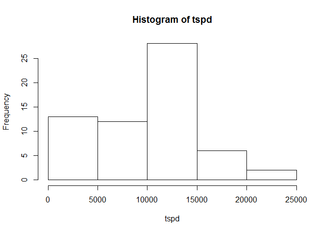
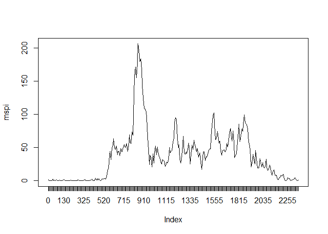
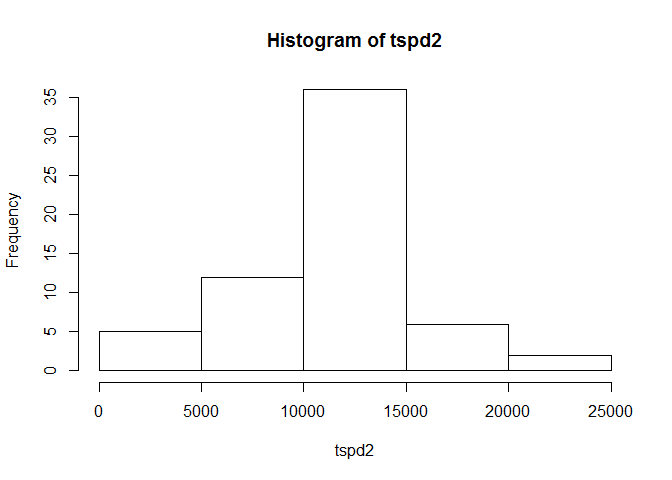
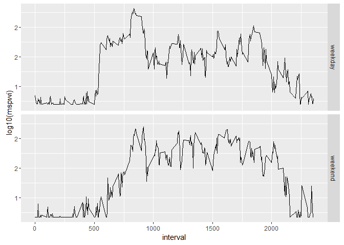

## Introduction

This assignment makes use of data from a personal activity monitoring device. This device collects data at 5 minute intervals through out the day. The data consists of two months of data from an anonymous individual collected during the months of October and November, 2012 and include the number of steps taken in 5 minute intervals each day.

The data for this assignment can be downloaded from the course web site as [Activity monitoring data][1] [52K]. It is stored in a comma-separated-value (CSV) file and there are a total of 17,568 observations.
The variables included in this dataset are:

* **steps**: Number of steps taking in a 5-minute interval (missing values are coded as NA)
* **date**: The date on which the measurement was taken in YYYY-MM-DD format
* **interval**: Identifier for the 5-minute interval in which measurement was taken

By means of exploratory data analysis the author adresses following questions:

1. **What is mean total number of steps taken per day?**
2. **What is the average daily activity pattern?**
3. **Are there differences in activity patterns between weekdays and weekends?**

## Loading and preprocessing the data

The below code loads the original data and creates additional columns required for further analysis.

```r
act_df <- read.csv("activity.csv") #load data
act_df$mydate <- as.Date(act_df$date) #add formatted date
```

## Computations - part 1

For this part of the assignment the missing values of **steps** measure in the dataset are ignored.

**What is mean total number of steps taken per day?**

The total number of **steps** taken per day is calulated with the following code.

```r
tspd <- tapply(act_df$steps, act_df$mydate, sum, na.rm=T) #total number of steps taken per day
```

Here is a histogram produced with base R function *hist* by executing *hist(*tspd*)*.


And here is a summary of the calculated data.

```r
summary(tspd)
```

```
##    Min. 1st Qu.  Median    Mean 3rd Qu.    Max. 
##       0    6780   10400    9350   12800   21200
```

You can see that the mean and the median of the total number of **steps** taken per day are respectively 9350 and 10400.

**What is the average daily activity pattern?**

The following code is used to make a time series plot of the 5-minute **interval** (x-axis) and the average number of **steps** taken, averaged across all days (y-axis).


```r
mspi <- tapply(act_df$steps, act_df$interval, mean, na.rm=T) #mean number of steps per interval
xnames <- names(mspi) #prepare tick scale for x-axis
plot(mspi, xaxt="n", type="l") #plot linear-type w/o ticks in x-axis
axis(1, at=1:length(xnames), labels=xnames) #insert tick scale for x-axis
```



The maximum number of **steps**, on average across all the **dates** in the dataset, is equal to 206 and corresponds to 835-th 5-minute **interval**.

## Computations - part 2

Note that there are 2304 of records where **steps** measure has missing values. The presence of missing values may introduce bias into some calculations or summaries of the data. 

For this part of the assignment the missing values in the dataset are imputed using the following strategy.

<!--
1. Express a **date** as a weekday and pair it with an **interval** as a separate weekday-interval variable.
2. Calculate mean of **steps** per weekday-interval.
3. For each weekday-interval with missing **steps** use the calculated mean for this weekday-interval.
This is the code with the realization of the above strategy.

```r
act_df$mysteps <- act_df$steps #create new steps variable to impute the missing values
act_df$weekdays <- weekdays(act_df$mydate) #transform date to weekday
act_df$wdi <- paste0(act_df$weekdays, ".", act_df$interval) #concatenate weekday with interval
act_df$mysteps[which(is.na(act_df$mysteps))] <- mean(act_df$mysteps, na.rm=T) #impute the missing values
```
-->

1. Calculate mean of **steps** for all dates.
2. For each missing **steps** value use the calculated mean.

This is the code with the realization of the above strategy.

```r
act_df$mysteps <- act_df$steps #create new steps variable to impute the missing values
act_df$mysteps[which(is.na(act_df$mysteps))] <- mean(act_df$mysteps, na.rm=T) #impute the missing values
```

**What is mean total number of steps taken per day?**

Similarly to the previous section, the total number of **steps** (with imputed missing values) taken per day is calulated with the following code.

```r
tspd2 <- tapply(act_df$mysteps, act_df$mydate, sum) #total number of steps taken per day
```

Here is a histogram produced with base R function *hist* by executing *hist(*tspd2*)*.


And here is a summary of the calculated data.

```r
summary(tspd2)
```

```
##    Min. 1st Qu.  Median    Mean 3rd Qu.    Max. 
##      41    9820   10800   10800   12800   21200
```

You can see that the mean and the median of the total number of **steps** taken per day are respectively 10800 and 10800. These values differ from the estimates from the previous section, so that the mean increases by about 16% and the median - by about 4%. So it looks the used strategy for imputing missing data has impact on the estimates of the total daily number of steps in such a way that it increases the mean and the median and evens these parameters.

**Are there differences in activity patterns between weekdays and weekends?**

To answer this question first a new factor variable **wday** is created in the dataset with two levels - "weekday" and "weekend" indicating whether a given **date** is a weekday or weekend day.

```r
act_df$weekdays <- weekdays(act_df$mydate)
library(timeDate)
act_df$wday <- 1
act_df$wday[as.vector(which(isWeekday(act_df$mydate)))] <- "weekday"
act_df$wday[which(act_df$wday==1)] <- "weekend"
```

Next, calculate the mean number of **steps** taken, averaged across all **intervals** and weekday/weekend days accordingly.

```r
act_df$mspwi <- ave(act_df$mysteps, act_df$wday, act_df$interval, FUN=mean)
```

Here is a panel plot containing a time series of the 5-minute **interval** (x-axis) and the average number of **steps** (y-axis) grouped by **wday** variable.

```r
library(ggplot2)
ggplot(act_df, aes(x=interval, y=log10(mspwi))) + geom_line() + facet_grid(wday~.)
```



[1]: https://d396qusza40orc.cloudfront.net/repdata%2Fdata%2Factivity.zip
